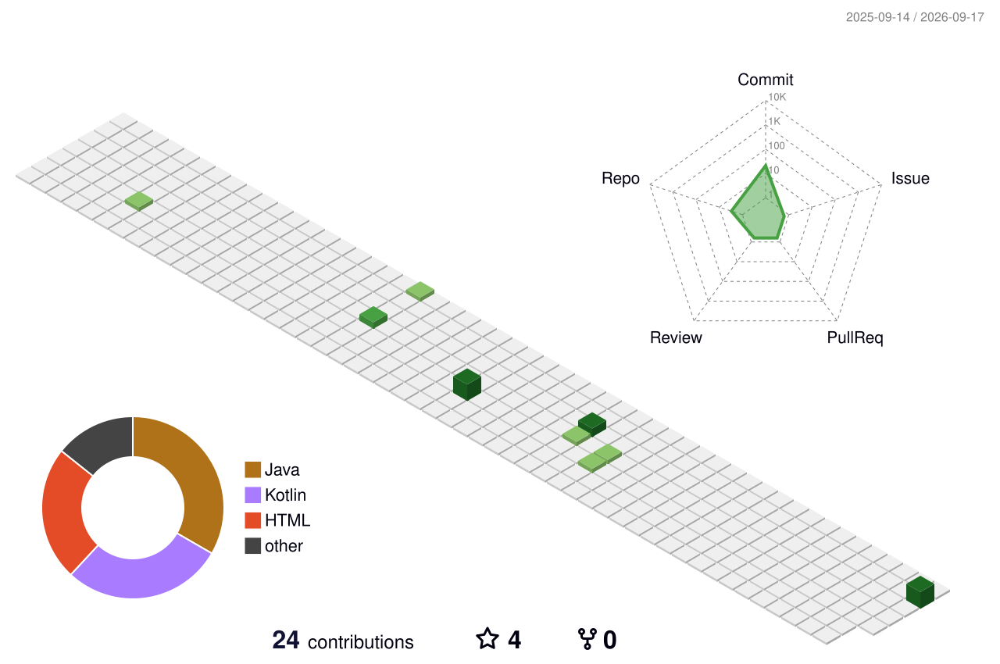

#  Olá! Eu sou **Leandro SJ**

### 👨‍💻 Analista de Sistemas | Automação | Java Backend | Linux | SQL

Atuo com implantação e suporte de sistemas para varejo e desenvolvo ferramentas para **automatizar processos, integrar sistemas e resolver problemas reais de operação**.

- ⚙️ Experiência com ERP, PDV, implantação e troubleshooting
- 🐧 Linux, redes, SQL e automação fazem parte do meu dia a dia
- ☕ Atualmente aprofundando conhecimentos em Java e Spring Boot
- 📱 Também desenvolvo aplicações Android com Kotlin

---

## 🚀 Projetos em destaque

### 🚗 [classicTracker](https://github.com/leandroSJ/classicTracker)
Aplicativo Android para acompanhar consumo de combustível, autonomia, abastecimentos, rotas GPS, custo por quilômetro e manutenção do veículo.

**Kotlin • Android • Jetpack Compose • Room • GPS**

### ⚙️ [Automação de processos ERP](https://github.com/leandroSJ/Arius-sistemas-automacao-para-ERP)
Conjunto de automações em Python criado para reduzir tarefas repetitivas em operações de ERP no varejo, incluindo processamento de XML, planilhas, relatórios e rotinas operacionais.

**Python • XML • Excel • Automação • ERP**

### 💾 [Backup automatizado de NFC-e](https://github.com/leandroSJ/Arius-Sistemas-Backup-NFCE-v4.0)
Ferramenta para automatizar backup de XMLs NFC-e, arquivos de configuração e outros dados importantes do ambiente de operação.

**Python • Backup • Google Drive • Automação**

### 📋 [Checklist de Implantação](https://github.com/leandroSJ/checklist-implantacao)
Ferramenta web para padronizar implantações de sistemas, acompanhar dezenas de etapas técnicas e visualizar o progresso em tempo real.

**JavaScript • HTML • CSS • Chart.js**

---

## 🛠️ Tecnologias

### Desenvolvimento

### Banco de Dados

### Infraestrutura e Ferramentas

### 📚 Atualmente estudando

---

## 📊 GitHub

  
  

<picture>
  <source media="(prefers-color-scheme: dark)" srcset="./profile-3d-contrib/profile-night-green.svg" />
  <source media="(prefers-color-scheme: light)" srcset="./profile-3d-contrib/profile-green-animate.svg" />
  
</picture>

---

## 📫 Contato

