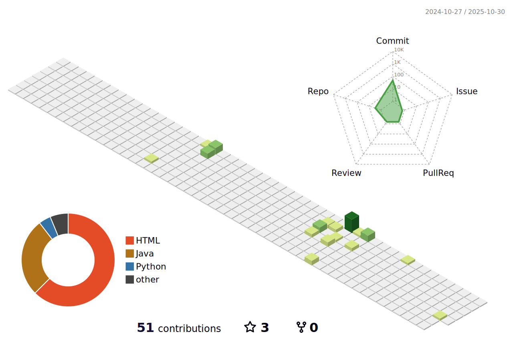

#  Hi, I'm [**Leandro SJ**](https://socrabytes.github.io/) 

`🚀 Learning Java | ☁️ tech Enthusiast | ⚙️ Backend`

I like challenges and solving problems and bugs using tech
&nbsp;

  
 

 
#### Top Repositories

 
 
 
 &nbsp;
 &nbsp;

<!-- 3D-Contribution Graph -->
<picture>
  <source media="(prefers-color-scheme: dark)" srcset="./profile-3d-contrib/profile-night-green.svg" />
  <source media="(prefers-color-scheme: light)" srcset="./profile-3d-contrib/profile-green-animate.svg" />
  
</picture>

## My Skills

#### Main Stack:
&nbsp;
&nbsp;
&nbsp;
&nbsp;
&nbsp;

#### Studying in this moment:

&nbsp;

#### Databases:

&nbsp;
&nbsp;

#### Workstation Tools:

&nbsp;
&nbsp;
  

&nbsp;
&nbsp;

## Contacts:

 

 

&nbsp;&nbsp; 
  
<!--  -->
